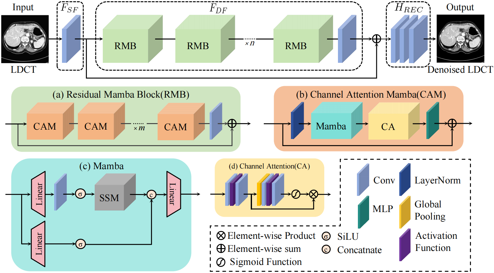
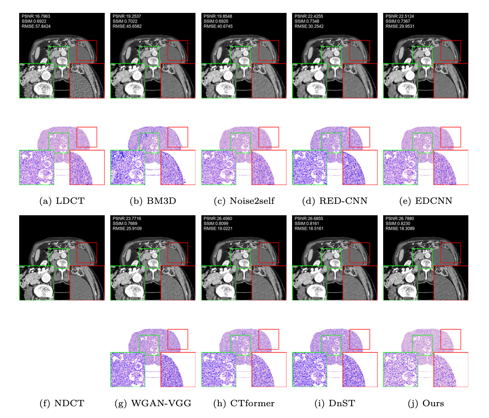

# DnMamba
Implementation of the Article _DnMamba: Efficient Shallow-Deep Feature Fusion for Low-Dose CT Denoising_
This respository is based on https://github.com/SSinyu/RED-CNN and https://github.com/state-spaces/mamba


<p align="center">Figure 1: The Overall architecture of the proposed DnMamba</p>

# Data
The 2016 NIH-AAPM-Mayo Clinic Low Dose CT Grand Challenge by Mayo Clinic https://www.aapm.org/GrandChallenge/LowDoseCT/

# Usage
```
#Train
>>python main.py
#Test
>>python main.py --mode test
```

# Result

<p align="center">Figure 2: Comparison of noise reduction results across different methods</p>


